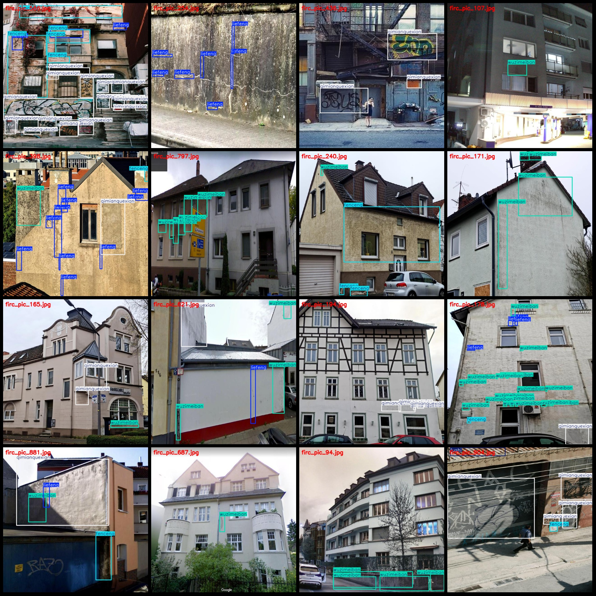
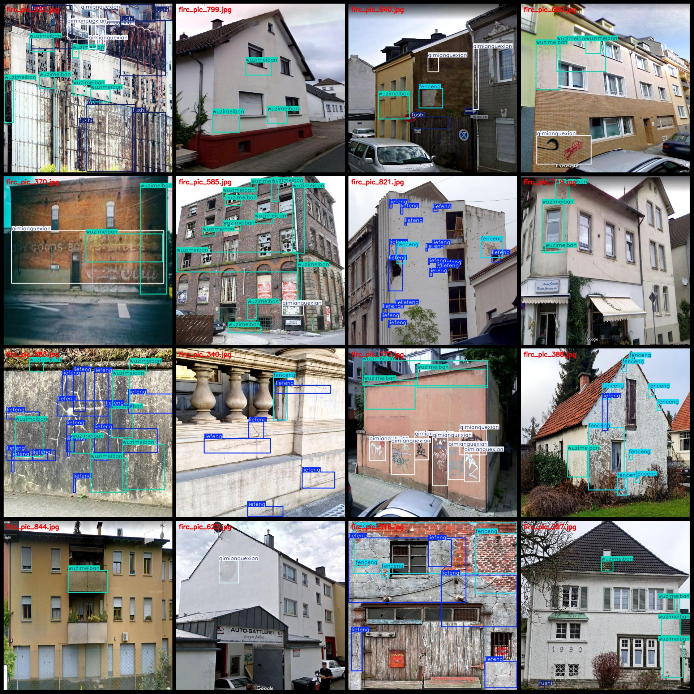

# Old House Building Surface Defects, Corrosion, Cracking and Falling Detection Dataset in VOC+YOLO format with 1000 images across 5 categories

Please pay attention to the dataset, specifically check the image preview.
Dataset format: Pascal VOC format + YOLO format (txt file without split path, only containing jpg images and corresponding VOC format xml file and yolo format txt file)
number of images: 1000  
annotation count: 1000  
Number of txt files: 1000
annotationnumber of classes: 5  
["fenceng","fushi","liefeng","qimianquexian","wuzimeiban"]
["Layered", "Corrosion", "Cracks", "Paint Defects", "Dirt/Mould"]
boxes per class:   
fenceng box count = 1018  
fushi box count = 352  
liefeng box count = 1704  
qimianquexian box count = 1724  
wuzimeiban box count = 2741  
total boxes: 7539  
Number of images per category:
fenceng images = 358  
fushi images = 108  
liefeng images = 443  
qimianquexian images = 489  
wuzimeiban images = 633  
Image resolution: 640x640
Use annotation tool: labelImg.
Rules for annotation: draw a rectangle around the category.
Important Note: The dataset does not have a separate train, validation, and test set. You need to manually split the data yourself.
Special Statement: This dataset does not guarantee the accuracy of the trained model or weight file.
Image preview:
## Images

Here is a pay link on Stripe ( https://buy.stripe.com/3cs8yP7sY87d0vu9AB ). Please contact me lonlonago@foxmail.com after funding $89, and I will send you a complete data files , thank you!

